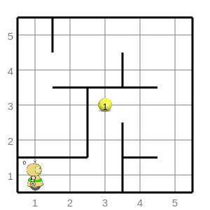

**Увод**
=========================
Добродошao/Добродошла!

Налазимо се у Петљиној онлајн учионици где смо за вас припремили часове програмирања за 
шести разред у програмском језику Python. Кроз наредне лекције постепено ћете прећи на текстуално програмирање.

Пред вама су лекције које прате све оно што је предвиђено да се ради и на редовним часовима Информатике и рачунарства
у школи. Лекције су прилагођене вашем узрату. Организовали смо их да имају теоријски део који чине текст, видеи, питалице и 
након тога долази мини квиз који ће вам помоћи да процените колико сте градива усвојили из лекције коју сте управо прочитали.

Након већих целина, припремили смо за вас и тестове којима пратимо ваш напредак.

Пре него што пређемо на први час, хајде да се укратко упознамо са оним што ћете учити.

**Робот Карел**
~~~~~~~~~~~~~~~

Прво ћемо се упознати са роботом који се зове Карел. Карел се налази у свом лавиринту. Ваш задатак ће бити да 
помогнете роботу да успешно савладате кретање кроз лавиринт. Док будете помагали Карелу, учићете уједно и да програмирате.
Припремили смо посебан језик који Карел разуме. Упознаћемо вас са њим.  

Језик којим се обраћамо Карелу сличан је програмском језику Python. На овај начин уводимо вас у синтаксу програмског језика Python.

**Програмски језик Python**
~~~~~~~~~~~~~~~~~~~~~~~~~~~

Када пређемо на текстуално програмирање, проћићемо кроз основне концепте које си већ видео у петом разреду. 
Сада линијске структуре програма, гранање, итерације, листе и остало, изучавамо помоћу текстуалног програмског језика. 

Детаљно читај лекције, прати видео туторијале и решавај питалице. Свој напредак прати кроз наше тестове који се 
налазе на крају сваке лекције.

**Окружење**
~~~~~~~~~~~~~~~~~~~~~~~~~~~

Програме ћеш писати у окружењу које је интерактивно, можеш видети на слици испод. Предност програмирања у оваквом окружењу је у томе
што ћеш одмах сазнати да ли је то што је написано тачно или не. На располагању су дугме `Покрени програм`, `Врати на почетак` и `Blockly`.
У наредним лекцијама ћемо те детаљније упознати са окружењем.

.. karel:: Карел_на_поље_33_Blockly
   :blockly:

   {
        setup:function() {
            var world = new World(5,5);
            world.setRobotStartAvenue(1);
            world.setRobotStartStreet(1);
            world.setRobotStartDirection("E");
            world.putBall(3, 3);
            world.addEWWall(1, 1, 2);
            world.addNSWall(2, 2, 2);
            world.addEWWall(2, 3, 3);
            world.addNSWall(3, 1, 2);
            world.addNSWall(3, 4, 1);
            world.addNSWall(1, 5, 1);
            world.addEWWall(4, 1, 1);
          
            var robot = new Robot();

            var code = ["from karel import *",
                    "napred()      # idi napred",
                    "napred()      # idi napred",
                    "napred()      # idi napred",
                    "napred()      # idi napred"];
            return {robot:robot, world:world, code:code};
        },

        isSuccess: function(robot, world) {
           return robot.getStreet() === 3 &&
           robot.getAvenue() === 3 &&
       robot.getBalls() === 1;
        },
   }

Желимо ти успешан рад!

