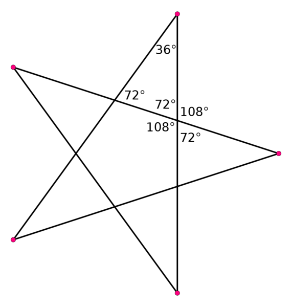

5.1. Гранање
############

Гранање
-------

Као што смо већ видели, гранање нам омогућава да у зависности од
испуњености неког услова извршимо једну или другу наредбу. Подсестимо
се, гранање, тј. условно извршавање наредби, постижемо помоћу наредбе
``if-else``. Прикажимо у наставку неколико програма у којима се
гранање користи у програмима са корњача графиком.

Приликом цртања неких фигура корњача наизменично треба да извршава
одређене врсте наредби. На пример, приликом цртања испрекидане линије
корњача у сваком кораку помера напред и након сваког померања или
подиже или спушта оловку и то чини наизменично (напред, подигни,
напред, спусти, напред, подигни, напред, спусти). То је могуће постићи
тако што се у сваком кораку петље, применом гранања, испитује да ли је
вредност бројача парна или непарна тј. да ли при дељењу са два даје
остатак 0. Као што ћемо детаљније описати на часу на ком ћемо се
бавити израчунавањем, у језику Python се остатак при дељењу броја
``i`` са 2 може израчунати помоћу ``i % 2``).

Испрекидана линија
''''''''''''''''''

.. questionnote::	   

   Нацртај поново испрекидану линију, али овај пут коришћењем гранања.

Корњача иде напред 10 пута, при чему пет пута од тога има подигнуту, а
пет пута има спуштену оловку. Дакле, уведи петљу чије се тело понавља
пет пута, у телу петље помери корњачу за 20 корака, а затим или
подигни или спусти оловку, тако да то буде наизменично (то можеш
реализовати тако што ћеш у парним корацима подизати, а у непарним
корацима спуштати оловку). Имајући ово у виду исправи наредни програм
тако да црта испрекидану линију.

.. activecode:: испрекидана_линија_1
   :nocodelens:
   :enablecopy:
   :playtask:

   import turtle
   for i in range(0):
       turtle.forward(0)
       if True:
           turtle.penup()
       else:
           turtle.pendown()
   ====
   import turtle
   for i in range(10):
       turtle.forward(20)
       if i % 2 == 0:
           turtle.penup()
       else:
           turtle.pendown()   

Погледај наредни видео:

.. ytpopup:: 8N1mQD16w74
    :width: 735
    :height: 415
    :align: center

   
Звезда без пресецања
''''''''''''''''''''

.. questionnote::

   Напиши програм у којем корњача црта звезду без цртања унутрашњег
   петогула, као на следећој слици.

   .. image:: ../../_images/kornjaca-zvezda.png
      :align: center

Израчунајмо унутрашње и спољашње углове звезде са 5 кракова.

Звезда са пет кракова се састоји од централног правоуглог петоугла на
чијим се ивицама налазе једнакостранични троуглови. Збир унутрашњих
углова у правилном петоуглу је :math:`(5-2)\cdot 180^\circ` тако да је
сваки угао једнак :math:`108^\circ`. Ако посматрамо углове на базама
два суседна крака (једнакостранична троугла) видимо да су они унакрсни
и да заједно са углом од :math:`108^\circ` и са њему унакрсном углом
чине пун угао. Стога је сваки угао на основици крака једнак
:math:`\frac{360^\circ - 2 \cdot 108^\circ}{2} = 72^\circ`. Пошто је
збир углова у краку једнак :math:`180^\circ`, угао при врху крака
једнак је :math:`180^\circ - 2 \cdot 72^\circ = 36^\circ`. Та
информација нам је кључна да бисмо могли да нацртамо звезду.

Звезду можемо нацртати тако што нацртамо десет дужи (десет кракова
једнакокраких троуглова који представљају краке звезде). Након цртања
сваке од тих дужи окрећемо се и то наизменично налево за
:math:`72^\circ` (када смо у дну крака) па надесно за
:math:`180^\circ - 36^\circ = 144^\circ` (када смо на врху
крака). Поново наизменично изршавање наредби (овај пут окретања)
можемо остварити тако што проверавамо парност бројачке променљиве.
     
.. activecode:: корњача_петокрака_1
   :nocodelens:
   :enablecopy:

   import turtle
   for i in range(10):        # ponovi 10 puta:
       turtle.forward(40)     #    idi napred 40 koraka
       if ???:                #    ako je vrednost brojaca i paran broj:
           turtle.???         #       okrneni se ulevo za 72 stepena
       else:                  #    u suprotnom:
           turtle.???         #       okreni se udesno za 144 stepena

	   
