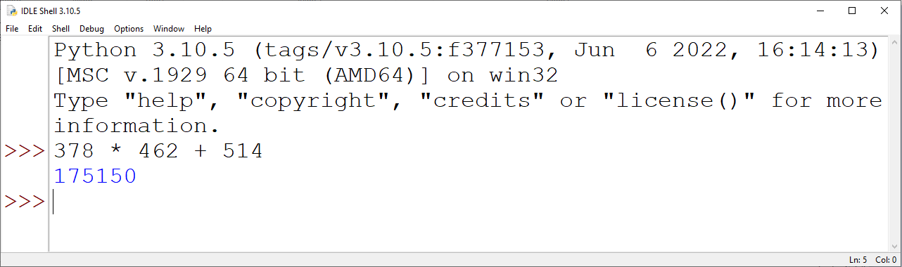
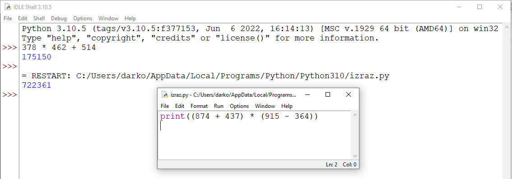

7.1. Основне аритметичке операције и примена
############################################

Рачунар или компјутер (енгл. computer) је справа која рачуна
тј. справа која је направљена тако да може веома брзо и ефикасно да
изводи рачунске операције над бројевима. Рачунање се назива и
аритметика (од грчке речи ἀριθμός тј. аритмос која значи број,
бројање, рачунање), а рачунске операције се називају и аритметичке
операције.

Сабирање, одузимање, множење
----------------------------

О аритметичким операцијама и њиховој примени си учио/учила још у нижим
разредима.

- Основна аритметичка операција је **сабирање**. Збир бројева 3 и 5 се у
  математици представља као *3 + 5*. У програмском језику Python
  користи се готово идентичан запис ``3 + 5``.
- Поред сабирања можемо разматрати **одузимање**. Разлика бројева 8 и 2 се
  у математици представља као *8 - 2*. У програмском језику Python
  користи се готово идентичан запис ``8 - 2``.
- Још једна од основних операција је и **множење**. Производ бројева 4 и 6 се
  у математици представља као *4 · 6*. У програмском језику Python множење
  се означава помоћу оператора ``*`` и производ бројева 4 и 6 се записује
  као ``4 * 6``.

У програмском језику Python, наравно, можемо и да делимо, да израчунавамо остатак
при дељењу и цео део количника и много штошта друго. О овим операцијама
ћемо говорити на неком од наредних часова.

.. suggestionnote::
   Приметимо да смо око оператора куцали размаке (на пример, ``3 + 5``, 
   ``8 - 2`` или ``4 * 6``). Ти размаци нису неопходни и исправно
   је написати и ``3+5`` или ``4*6``. Програмери воле да куцају размак
   око сваког оператора (знака операције) да би добили текст програма
   који лепше изгледа и који се лакше може прочитати.

Ако на свом рачунару покренеш интерпретатор за програмски језик
Python, вредност неког израза (на пример, ``3 + 5`` или ``4 * 6``)
можеш израчунати тако што тај израз просто укуцаш (иза знакова
``>>>``) и притиснеш тастер Enter. На пример,

::

  Python 3.10.5 (tags/v3.10.5:f377153, Jun  6 2022, 16:14:13) [MSC v.1929 64 bit (AMD64)] on win32
  Type "help", "copyright", "credits" or "license()" for more information.
  >>> 3 + 5
  8
  >>> 4 * 6
  24

.. technicalnote::
   Међутим, за вежбу ти чак није потребно да инсталираш Python на свом
   рачунару, већ и у овом случају програме можеш уносити и у поља која се
   налазе на страницама овог интерактивног приручника. У та поља се уносе
   комплетни програми (додуше, они ће у почетку бити прилично кратки) и
   стога, да би се одштампала вредност неког израза, рачунару мораш
   некако рећи да он ту вредност одштампа. 

*Штампај* се на енглеском језику каже *print*, па се онда вредност израза може добити на следећи
начин.
  
.. activecode:: сабирање_и_множење
   :autorun:
      
   print(3 + 5)
   print(4 * 6)

Подесили смо да се овај програм покрене чим се ова страница учита и са
десне стране можеш видети резултате његовог израчунавања (одштампане
бројеве 8 и 24).

Пробај сада да прилагодиш претходни програм тако да исписује разлику
бројева 174 и 83 и производ бројева 24 и 36. 
Када направиш измене програм покрени дугметом **Покрени програм**. 
Ако је све урађено како треба, требало би да видиш резултате 91 и 864.

Рад из командне линије и писање програма
----------------------------------------

Покретањем интерпретатора за Python (на пример, покретањем окружења
Python IDLE), приказује се командни прозор у који се могу уносити
изрази чија се вредност одмах израчучнава и приказује.

Ово је погодно само за веома кратка израчунавања. У случају када
желимо да вршимо мало сложенија израчунавања, обично пишемо
једноставне програме. 

.. technicalnote::
   Писање новог програма у окружењу IDLE започињемо командом менија `File → New File`,
   након чега се отвара едитор програмског кода у који уписујемо наш
   програм. Када је програм написан, покрећемо командом менија `Run → Run
   Module` или пречицом на тастатури `F5`. Пре него што се програм изврши (пре него што изврши наредбе које се у њему налазе),
   неопходно га је сачувати (уобичајено је да то буде у датотеци са
   екстензијом `.py`).

Изрази у програму се израчунавају, али се њихова вредност не приказује
аутоматски. Ако желимо да прикажемо вредност неког израза, потребно је
да употребимо наредбу ``print``. Сваки пут када се програм покрене,
резултати његовог рада се приказују у командном прозору.

.. technicalnote::
   Рецимо и да је програме могуће креирати помоћу било ког едитора
   чистог текста (могуће је користити и Notepad) и након чувања могуће
   их је покретати из командне линије оперативног система (најчешће
   тако што се покрене команда ``python <ime_skripta>`` или ``python3
   <ime_skripta>``).

.. technicalnote::
   У прозоре на Петљи се пишу (куцају се наредбе) програми, који се онда покрећу дугметом
   ``Покрени програм``. Зато је за сваки жељени приказ резултата непходно
   употребити наредбу ``print``. За разлику од окружења IDLE, пре
   покретања програма није га потребно сачувати.

Смедеревска тврђава
'''''''''''''''''''

Покушај да решиш наредни, веома једноставан задатак на неколико начина:

- израчунај вредност помоћу обичног калкулатора твог оперативног система;
- израчунај вредност уносом израза у командну линију Python интерпретатора;
- израчунај и прикажи вредност писањем једноставног програма у прозору који је
  приказан у склопу ове веб-странице;
- напиши програм у окружењу IDLE, сачувај га и покрени.

.. questionnote::

   Смедеревска тврђава има облик троугла страница 550m, 502m и
   400m. Колики је обим тврђаве (када шеташ око тврђаве, колико ћеш
   метара прећи)?

.. infonote::
   **Важна напомена:** Приликом уноса дужина страница не уносити *m* (ознаку мерне јединице)
   иза броја него само број!

.. activecode:: тврђава

   # напиши програм на овом месту

Ако је исправно написан, твој програм треба да испише вредност 1452.

Сложени изрази, приоритет оператора и заграде
---------------------------------------------
   
Некада је потребно да решавамо задатке који укључују више рачунских
операција и тада можемо користити сложеније изразе, потпуно исто како
смо навикли у математици. На пример, посматрајмо следећи задатак, који
је преузет из једне збирке задатака из математике.

Производ збира и разлике
''''''''''''''''''''''''

.. questionnote::

   Израчунај производ збира бројева 874 и 437 и разлике бројева 915 и 364. 

   
Уз помоћ рачунара можеш веома једноставно решити овај задатак (чак
једноставније него помоћу дигитрона тј. калкулатора). Једино је важно
да умеш исправно да запишеш израз којим се тражено израчунавање
изражава. У математици би се одговарајући израз записао као
*(874+437)·(915-364)*. Ако се сетиш да се множење изражава знаком
``*`` и, ако ти кажемо да у програмском језику Python можеш
употребљавати заграде на исти начин као у математици, онда ти је јасно
да претходни математички задатак можеш лако решити тако што употребиш
израз ``(874 + 437) * (915 - 364)``, тј. наредни програм (притисни
дугме **Покрени програм** да би се програм извршио, односно да би програм извршио наредбе које се у њему налазе).

.. activecode:: производ_збира_и_разлике

   print((874 + 437) * (915 - 364))		

Заграде су у претходном сложеном изразу неопходне, јер је приоритет
операција потпуно исти као у математици (прво се израчунава оно што је
у заградама, затим множење и дељење, па тек онда сабирање и
одузимање).

Покушај да претходни задатак урадиш и у окружењу IDLE и то најпре тако
што ћеш израз ``(874 + 437) * (915 - 364)`` унети у командни прозор и
притиснути тастер Enter, а затим и тако што ћеш направити програм који
ради исти посао.

Уради наредни тест да провериш да ли си потпуно разумео/разумела
досадашње излагање.
   
.. mchoice:: vrednost_izraza_1
   :answer_a: 15
   :answer_b: 30
   :answer_c: 50
   :answer_d: 125
   :correct: b
   :feedback_a: Знак ``+`` означава сабирање, а знак ``*`` множење.
   :feedback_b: Тачно!
   :feedback_c: Обрати пажњу и на приоритет операција (исти је као и у математици).
   :feedback_d: Знак + означава сабирање, а знак * множење.
		
   Која је вредност израза ``5 + 5 * 5``?

.. mchoice:: vrednost_izraza_2
   :answer_a: 15
   :answer_b: 30
   :answer_c: 50
   :answer_d: 125
   :correct: c
   :feedback_a: Знак ``+`` означава сабирање, а знак ``*`` множење.
   :feedback_b: Обрати пажњу на то да прво треба да израчунаш оно што
                је у заградама.
   :feedback_c: Тачно!
   :feedback_d: Знак + означава сабирање, а знак * множење.
		
   Која је вредност израза ``(5 + 5) * 5``?

.. mchoice:: vrednost_izraza_3
   :answer_a: print((184 + 72) * (273 - 194))
   :answer_b: print((184 - 72) * (273 - 194))
   :answer_c: (184 - 72) * (273 - 194)
   :answer_d: print(184 - 72 * 273 - 194)
   :correct: b
   :feedback_a: Обрати пажњу на то шта је збир, а шта разлика.
   :feedback_b: Тачно!
   :feedback_c: Да би програм исписао резултат, мораш користити print.
   :feedback_d: Обрати пажњу на приоритет операција. Да ли ти требају заграде?
   
   Који од наредних програма израчунава и исписује производ разлике
   бројева 184 и 72 и разлике бројева 273 и 194.

Погледај наредни видео:

.. ytpopup:: pogysWedlXo
    :width: 735
    :height: 415
    :align: center
   
