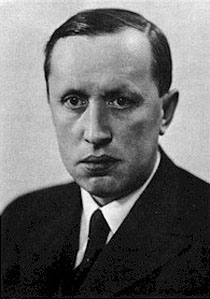

~~~~~~~~~~~~~~~~~~~~~~~~~~~~~~~~
Робот Карел: линијска структура
~~~~~~~~~~~~~~~~~~~~~~~~~~~~~~~~

.. topic:: У оквиру ове лекције упозћеш се са следећим појмовима: 
            
            - робот Карел

            - линијски програми

         

У овој лекцији упознаћеш се ближе са роботом Карелом и језиком који робот разуме. Карел је добио име по по чешком писцу Карелу Чапеку, 
који је први употребио реч робот.

Наредбе које Карел разуме
-------------------------

Робот Карел се налази у лавиринту и разуме наредне наредбе

- ``napred()`` - помери се једно поље напред,
- ``levo()`` - окрени се 90 степени налево (у смеру супротном казаљки на сату),
- ``desno()`` - окрени се 90 степени надесно (у смеру казаљке на сату),
- ``uzmi()`` - покупи лоптицу са поља на којем се налазиш,
- ``ostavi()`` - спусти лоптицу на поље на којем се налазиш
  
Робот Карел разуме и програмски језик Python и, програмирајући га,
научићемо неколико основних наредби тог језика. Испрограмирали смо га
тако да ради унутар прегледача веба и не мораш ништа додатно да
инсталираш да би писао програме за Карела. 

Линијски програми
-----------------
  
Прикажимо употребу ових наредби на неколико једноставних програма.

Иди до лоптице и узми је
''''''''''''''''''''''''
.. level:: 1

.. questionnote::

   Напиши програм на основу којега ће робот доћи на поље (3, 3) и
   покупити лоптицу.

Да би дошао на жељено поље робот мора два пута да иде напред, да се
окрене на лево, затим опет да иде два пута напред и на крају да покупи
лоптицу. То му можемо наредити наредним програмом.
   
.. karel:: Карел_на_поље_33

   {
        setup:function() {
            var world = new World(5,5);
            world.setRobotStartAvenue(1);
            world.setRobotStartStreet(1);
            world.setRobotStartDirection("E");
            world.putBall(3, 3);
            world.addEWWall(1, 1, 2);
            world.addNSWall(2, 2, 2);
            world.addEWWall(2, 3, 3);
            world.addNSWall(3, 1, 2);
            world.addNSWall(3, 4, 1);
            world.addNSWall(1, 5, 1);
            world.addEWWall(4, 1, 1);
            
	    var robot = new Robot();

	    var code = ["from karel import *",
					"napred()      # idi napred",
					"napred()      # idi napred",
					"levo()        # okreni se nalevo",
					"napred()      # idi napred",
					"napred()      # idi napred",
					"uzmi()        # uzmi lopticu"];
            return {robot:robot, world:world, code:code};
        },
	
        isSuccess: function(robot, world) {
           return robot.getStreet() === 3 &&
           robot.getAvenue() === 3 &&
	   robot.getBalls() === 1;
        },
   }

Прва линија програма ``from karel import *`` је линија којом почињу
сви програми за Карела - остави је таквом каква јесте. Након тога се
роботу задаје једна по једна наредба, свака у посебном реду. Иза сваке
наредбе роботу наведене су заграде (њих не смемо изоставити). Додатно,
свака наредба мора бити у посебном реду и испред наредби не смеш
писати размаке. Оваква правила називају се синтаксичка правила и ако
се неко од њих не испоштује долази до **синтаксичке грешке**. Програм не
сме садржати ни једну синтаксичку грешку да би исправно радио.

Текст иза знака ``#`` представља такозване коментаре. Робот тај текст
не чита - написали смо га само да би теби било јасније шта која
наредба значи.

У наредном програму има неколико синтаксичких грешака. Ако покушаш да
га покренеш добићеш поруку

::

   SyntaxError: bad input on line 4

Примети да је грешка пријављена у линији 4 иако је грешка направљена
већ у линији 3, где су изостављене заграде. Ово се често дешава, па
када анализираш где је грешка настала, увек провери и линију испред
оне која је у поруци о грешци наведена.
   
Исправи све синтаксичке грешке, па онда покрени програм.

.. karel:: Карел_на_поље_33_грешке

   {
        setup:function() {
            var world = new World(5,5);
            world.setRobotStartAvenue(1);
            world.setRobotStartStreet(1);
            world.setRobotStartDirection("E");
            world.putBall(3, 3);
            world.addEWWall(1, 1, 2);
            world.addNSWall(2, 2, 2);
            world.addEWWall(2, 3, 3);
            world.addNSWall(3, 1, 2);
            world.addNSWall(3, 4, 1);
            world.addNSWall(1, 5, 1);
            world.addEWWall(4, 1, 1);
          
			var robot = new Robot();

	    var code = ["from karel import *",
					"napred()",
					"napred",
					"  levo()",
					"napred)",
					"    napred[]",
					" uzmi{}"];
            return {robot:robot, world:world, code:code};
        },
	
        isSuccess: function(robot, world) {
           return robot.getStreet() === 3 &&
           robot.getAvenue() === 3 &&
	   robot.getBalls() === 1;
        },
   }

У претходном програму је свака наредба Карелу била написана у посебној
линији. Могуће је задати и више наредби у једној линији, али тада их
је потребно раздвојити тачка-запетом (симболом ``;``).

.. karel:: Карел_на_поље_33_један_ред

   {
        setup:function() {
            var world = new World(5,5);
            world.setRobotStartAvenue(1);
            world.setRobotStartStreet(1);
            world.setRobotStartDirection("E");
            world.putBall(3, 3);
            world.addEWWall(1, 1, 2);
            world.addNSWall(2, 2, 2);
            world.addEWWall(2, 3, 3);
            world.addNSWall(3, 1, 2);
            world.addNSWall(3, 4, 1);
            world.addNSWall(1, 5, 1);
            world.addEWWall(4, 1, 1);
          
			var robot = new Robot();

	    var code = ["from karel import *",
                        "napred(); napred(); levo(); napred(); napred(); uzmi()"];
            return {robot:robot, world:world, code:code};
        },
	
        isSuccess: function(robot, world) {
           return robot.getStreet() === 3 &&
           robot.getAvenue() === 3 &&
	   robot.getBalls() === 1;
        },
   }

Решење у којем је свака наредба у посебној линији се ипак мало чешће
користи (вероватно зато што се такав код лакше чита и мења, ако је то
потребно).

Уколико ти је лакше, можеш погледати и наредну видео запис који илуструје претходно градиво.

.. ytpopup:: s9KCMku_StY
      :width: 735
      :height: 415
      :align: center

.. infonote:: Провери своје знање кроз наредна питања на следећој страни.      
    
