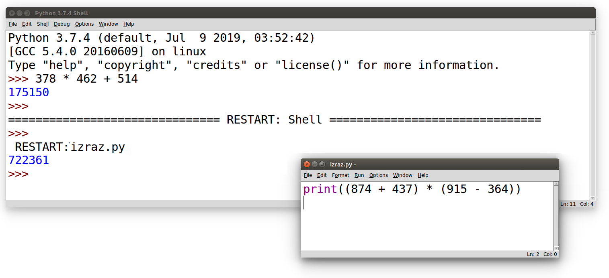

Час 7 - Основне аритметичке операције и примена
###############################################

Рачунар или компјутер (енгл. computer) је справа која рачуна
тј. справа која је направљена тако да може веома брзо и ефикасно да
изводи рачунске операције над бројевима. Рачунање се назива и
аритметика (од грчке речи ἀριθμός тј. аритмос која значи број,
бројање, рачунање), а рачунске операције се називају и аритметичке
операције.

Сабирање, одузимање, множење
----------------------------

О аритметичким операцијама и њиховој примени си учио/учила још у нижим
разредима.

- Основна аритметичка операција је **сабирање**. Збир бројева 3 и 5 се у
  математици представља као *3 + 5*. У програмском језику Python
  користи се готово идентичан запис ``3 + 5``.
- Поред сабирања можемо разматрати **одузимање**. Разлика бројева 8 и 2 се
  у математици представља као *8 - 2*. У програмском језику Python
  користи се готово идентичан запис ``8 - 2``.
- Још једна од основних операција је и **множење**. Производ бројева 4 и 6 се
  у математици представља као *4 · 6*. У програмском језику Python множење
  се означава помоћу оператора ``*`` и производ бројева 4 и 6 се записује
  као ``4 * 6``.

Програмски језик Python, наравно, уме и да дели, да израчунава остатак
при дељењу и цео део количника и много штошта друго. О овим операцијама
ћемо говорити на неком од наредних часова.

.. infonote::

   Приметимо да смо око оператора куцали размаке (на пример, ``3 +
   5``, ``8 - 2`` или ``4 * 6``). Ти размаци нису неопходни и исправно
   је написати и ``3+5`` или ``4*6``. Програмери воле да куцају размак
   око сваког оператора (знака операције) да би добили текст програма
   који лепше изгледа и који се лакше може прочитати.

Ако на свом рачунару покренеш интерпретатор за програмски језик
Python, вредност неког израза (на пример, ``3 + 5`` или ``4 * 6``)
можеш израчунати тако што тај израз просто укуцаш (иза знакова
``>>>``) и притиснеш тастер Enter. На пример,

::

  Python 3.7.4 (default, Jul  9 2019, 03:52:42) 
  [GCC 5.4.0 20160609] on linux
  Type "help", "copyright", "credits" or "license" for more information.
  >>> 3 + 5
  8
  >>> 4 * 6
  24

Међутим, за вежбу ти чак није потребно да инсталираш Python на свом
рачунару, већ и у овом случају програме можеш уносити и у поља која се
налазе на страницама овог интерактивног приручника. У та поља се уносе
комплетни програми (додуше, они ће у почетку бити прилично кратки) и
стога, да би се одштампала вредност неког израза, рачунару мораш
некако рећи да он ту вредност одштампа. *Штампај* се на енглеском
језику каже *print*, па се онда вредност израза може добити на следећи
начин.
  
.. activecode:: сабирање_и_множење
   :autorun:
      
   print(3 + 5)
   print(4 * 6)

Подесили смо да се овај програм покрене чим се ова страница учита и са
десне стране можеш видети резултате његовог израчунавања (одштампане
бројеве 8 и 24).

Пробај сада да прилагодиш претходни програм тако да исписује разлику
бројева 174 и 83 и производ бројева 24 и 36. Када направиш измене
програм покрени дугметом **Покрени програм**. Ако је све урађено како
треба, требало би да видиш резултате 91 и 864.

Рад из командне линије и писање скриптова
-----------------------------------------

Покретањем интерпретатора за Python (на пример, покретањем окружења
Python IDLE), приказује се командни прозор у који се могу уносити
изрази чија се вредност одмах израчучнава и приказује.

.. image:: ../../_images/idle-shell.png
   :width: 400px   
   :align: center

Ово је погодно само за веома кратка израчунавања. У случају када
желимо да вршимо мало сложенија израчунавања, обично пишемо
једноставне програме који се називају и **скриптови**. Писање новог
скрипта у окружењу IDLE започињемо командом менија `File → New File`,
након чега се отвара едитор програмског кода у који уписујемо наш
скрипт. Када је скрипт написан, покрећемо командом менија `Run → Run
Module` или пречицом на тастатури `F5`. Пре него што се скрипт изврши,
неопходно га је сачувати (уобичајено је да то буде у датотеци са
екстензијом `.py`).

Изрази у скрипту се израчунавају, али се њихова вредност не приказује
аутоматски. Ако желимо да прикажемо вредност неког израза, потребно је
дан употребимо наредбу ``print``. Сваки пут када се скрипт покрене,
резултати његовог рада се приказују у командном прозору.

.. infonote::

   Рецимо и да је скриптове могуће креирати помоћу било ког едитора
   чистог текста (могуће је користити и Notepad) и након чувања могуће
   их је покретати из командне линије оперативног система (најчешће
   тако што се покрене команда ``python <ime_skripta>`` или ``python3
   <ime_skripta>``).

У прозоре на Петљи се уносе скриптови, који се онда покрећу дугметом
``Покрени програм``. Зато је за сваки жељени приказ резултата непходно
употребити наредбу ``print``. За разлику од окружења IDLE, пре
покретања скрипта није га потребно сачувати.

Смедеревска тврђава
'''''''''''''''''''

Покушај да решиш наредни, веома једноставан задатак на неколико начина:

- израчунај вредност помоћу обичног калкулатора твог оперативног система;
- израчунај вредност уносом израза у командну линију Python интерпретатора;
- израчунај и прикажи вредност писањем једноставног скрипта у прозору који је
  приказан у склопу ове веб-странице;
- напиши скрипт у окружењу IDLE, сачувај га и покрени.

.. level:: 1

.. questionnote::

   Смедеревска тврђава има облик троугла страница 550m, 502m и
   400m. Колики је обим тврђаве (када шеташ око тврђаве, колико ћеш
   метара прећи)?

.. activecode:: тврђава

   # напиши скрипт на овом месту

Ако је исправно написан, твој скрипт треба да испише вредност 1452.

Сложени изрази, приоритет оператора и заграде
---------------------------------------------
   
Некада је потребно да решавамо задатке који укључују више рачунских
операција и тада можемо користити сложеније изразе, потпуно исто како
смо навикли у математици. На пример, посматрајмо следећи задатак, који
је преузет из једне збирке задатака из математике.

Производ збира и разлике
''''''''''''''''''''''''
.. level:: 1

.. questionnote::

   Израчунај производ збира бројева 874 и 437 и разлике бројева 915 и 364. 

   
Уз помоћ рачунара можеш веома једноставно решити овај задатак (чак
једноставније него помоћу дигитрона тј. калкулатора). Једино је важно
да умеш исправно да запишеш израз којим се тражено израчунавање
изражава. У математици би се одговарајући израз записао као
*(874+437)·(915-364)*. Ако се сетиш да се множење изражава знаком
``*`` и, ако ти кажемо да у програмском језику Python можеш
употребљавати заграде на исти начин као у математици, онда ти је јасно
да претходни математички задатак можеш лако решити тако што употребиш
израз ``(874 + 437) * (915 - 364)``, тј. наредни програм (притисни
дугме **Покрени програм** да би се програм извршио).

.. activecode:: производ_збира_и_разлике

   print((874 + 437) * (915 - 364))		

Заграде су у претходном сложеном изразу неопходне, јер је приоритет
операција потпуно исти као у математици (прво се израчунава оно што је
у заградама, затим множење и дељење, па тек онда сабирање и
одузимање).

Покушај да претходни задатак урадиш и у окружењу IDLE и то најпре тако
што ћеш израз ``(874 + 437) * (915 - 364)`` унети у командни прозор и
притиснути тастер Enter, а затим и тако што ћеш направити скрипт који

Уради наредни тест да провериш да ли си потпуно разумео/разумела
досадашње излагање.
   
.. mchoice:: vrednost_izraza_1
   :answer_a: 15
   :answer_b: 30
   :answer_c: 50
   :answer_d: 125
   :correct: b
   :feedback_a: Знак ``+`` означава сабирање, а знак ``*`` множење.
   :feedback_b: Тачно!
   :feedback_c: Обрати пажњу и на приоритет операција (исти је као и у математици).
   :feedback_d: Знак + означава сабирање, а знак * множење.
		
   Која је вредност израза ``5 + 5 * 5``?

.. mchoice:: vrednost_izraza_2
   :answer_a: 15
   :answer_b: 30
   :answer_c: 50
   :answer_d: 125
   :correct: c
   :feedback_a: Знак ``+`` означава сабирање, а знак ``*`` множење.
   :feedback_b: Обрати пажњу на то да прво треба да израчунаш оно што
                је у заградама.
   :feedback_c: Тачно!
   :feedback_d: Знак + означава сабирање, а знак * множење.
		
   Која је вредност израза ``(5 + 5) * 5``?

.. mchoice:: vrednost_izraza_3
   :answer_a: print((184 + 72) * (273 - 194))
   :answer_b: print((184 - 72) * (273 - 194))
   :answer_c: (184 - 72) * (273 - 194)
   :answer_d: print(184 - 72 * 273 - 194)
   :correct: b
   :feedback_a: Обрати пажњу на то шта је збир, а шта разлика.
   :feedback_b: Тачно!
   :feedback_c: Да би програм исписао резултат, мораш користити print.
   :feedback_d: Обрати пажњу на приоритет операција. Да ли ти требају заграде?
   
   Који од наредних програма израчунава и исписује производ разлике
   бројева 184 и 72 и разлике бројева 273 и 194.

   
Променљиве - имена међурезултата
--------------------------------
   
Писање сложених израза се може избећи, а програм се може начинити мало
разумљивијим ако међурезултате именујемо. Погледајмо наредни пример
програма који такође решава претходни задатак.

.. activecode:: производ_збира_и_разлике_1
		
   zbir = 874 + 437
   razlika = 915 - 364
   proizvod = zbir * razlika
   print(proizvod)

   
Збиру смо доделили име ``zbir``, разлици име ``razlika``, а производу
име ``proizvod`` (уместо ``zbir`` и ``razlika`` могли смо, на пример,
користити и имена ``prvi_cinilac``, ``drugi_cinilac``). Иако се на
овај начин добија програм који мало дужи него полазни, он је мало
разумљивији, јер се његовим читањем може јасно видети да се прво тражи
израчунавање збира, затим разлике и затим њиховог производа. То се
десило пре свега захваљујући пажљивом одабиру имена која смо
употребили и веома је важно у програмима користити имена која читаоцу
програма дају назнаке шта тај програм заправо израчунава. Рачунар
једнако успешно извршава програм ма која имена да употребиш.  Ипак,
имај на уму да програме читају и људи који те програме пишу,
исправљају и дорађују, а њима је прилично важно да текст програма лако
разумеју. У већини случајева си читалац програма управо ти, тако да
давањем илустративних имена променљивима данас помажеш заправо себи у
будућности.

.. infonote::
   
   Имена која смо дали међурезултатима се у програмирању називају
   **променљиве**. Променљиве су јако важан концепт о коме ће бити
   много више речи касније. До тада ћемо их користити на потпуно исти
   начин као у математици - само као имена придружена одређеним
   вредностима.

Имена која користимо смеју да садрже само слова, цифре и подвлаке
(знак ``_``) - не смеју да садрже размаке, цртице ни остале
интерпункцијске знаке.

.. level:: 2
   :container:

   .. infonote::

        Рецимо да постоје и нека правила која се односе на имена (каже се и
        **идентификаторе**) која можемо користити.  Прво, постоји разлика
        између великих и малих слова и није исто да ли смо употребили
        ``zbir`` или ``Zbir``. Препоручује се да у именима користимо само
        слова енглеске абецеде (тзв. ошишану латиницу), бројеве и подвлаку
        (симбол ``_``), коју ћемо користити да повежемо више речи у једно
        име. У именима не можемо користити размаке, зарезе и слично, нити
        име можемо започети цифром. Дозвољена имена су, на пример, ``x``,
        ``obim``, ``drugi_sabirak``, ``broj_sekundi``, ``a2``, а недозвољена
        су, на пример, ``3d_grafika`` (јер почиње цифром), ``prvi sabirak``
        (јер садржи размак) и ``jezik_c#`` (јер садржи недозвољени знак
        ``#``).
       
        .. mchoice:: identifikatori
         :multiple_answers:
         :answer_a: xyZ
         :answer_b: Indijana_Dzons_3
         :answer_c: 3stvari
         :answer_d: zdravo-svima
         :correct: a,b
         :feedback_a: Било која комбинација слова је у реду.
         :feedback_b: Подвлаке се могу користити да повежу више делова у целину.
         :feedback_c: Цифра не сме бити први карактер.
         :feedback_d: Цртице се не смеју користити у склопу имена (цртица
                      тј. минус заправо означава одузимање).
       
         Шта од наведеног може бити исправно име променљиве у језику
         Python? Означи све тачне одговоре.

Решавање задатака у општим бројевима
------------------------------------

Коришћењем променљивих алгоритам можемо описати коришћењем назива, а
не вредности улазних величина, што често даје разумљивији текст
програма и даје могућност да се исти алгоритам примени и на друге
вредности улазних величина, без потребе за компликованим модификацијама
програма. На тај начин постижемо да једним програмом не решавамо само
један задатак, већ заправо читаву групу сродних задатака (у којима је
проблем који се решава исти, али су бројеви различити). Илуструјмо ово
на једном једноставном примеру.

Склапање коцкица
''''''''''''''''
.. level:: 1

Јова склапа играчкице од лего-коцкица. Жели да склопи један ауто за
који су му потребна 4 точка, 8 великих и 4 мале коцке и један бицикл
за који су му потребна 2 точка и 6 малих коцкица. Ако је цена точка 79
динара, цена мале коцке 59, а цена велике коцке 99 динара, напиши
програм који израчунава колико је динара потребно Јови да би купио све
потребне делове.

Једно могуће решење задатка је да се резултат израчуна формирањем
једног сложеног израза.

.. activecode:: склапање_коцкица_1
		
   print(4*79 + 8*99 + 4*59 + 2*79 + 6*59)

Иако овај програм коректно израчунава решење, он је прилично
неразумљив и тешко га је прилагодити, ако се, на пример, промене цене
делова. Преформулишимо сада програм коришћењем променљивих.

.. activecode:: склапање_коцкица_2
		
   cena_tocak = 79
   cena_velika = 99
   cena_mala = 59

   cena_automobil = 4*cena_tocak + 8*cena_velika + 4*cena_mala
   cena_bicikl = 2*cena_tocak + 6*cena_mala

   cena_ukupno = cena_automobil + cena_bicikl
   print(cena_ukupno)

Иако је добијени програм очигледно дужи, он је много разумљивији. Сви
улазни подаци, који могу да се промене (у овом случају то су цене
делова) наведени су у посебним променљивим на почетку скрипта. Ако се
цене промене, променићемо само првих неколико редова скрипта и
покренути скрипт поново, чиме ћемо добити резултат за нове улазне
величине. Тако наш програм постаје програм који не решава само један
одређен задатак, већ целу породицу задатака истог облика, а у којима
се разликују само улазни подаци.

Учитавање података при покретању програма
-----------------------------------------

У програмском језику Python и програмским језицима у којима се пишу
скриптови уобичајено је да се подаци задају на почетку програма и у
наредним програмима ћемо често користити такав приступ. Међутим,
постоје програмски језици у којима текст програма не мора бити
доступан пре покретања и у којима није могуће изменити улазне податке
пре покретања програма. Стога је честа пракса да се вредности улазних
података не уписују у текст програма, већ да се програм напише тако да се
приликом његовог покретања од корисника тражи да унесе вредности
улазних података. То је могуће урадити и у Python скриптовима.

Један начин да се затражи од корисника да унесе неки цео број је да се
у програму наведе ``broj = int(input("Unesi broj:"))``. Ако желимо да
допустимо да се уносе и реални бројеви, тада у програму морамо навести
``broj = float(input("..."))``. Уместо променљиве ``broj``, наравно,
унети број може да се запамти у било којој другој променљивој. Такође,
порука може бити сликовитија и текст ``Unesi broj`` између двоструких
наводника је могуће променити (на пример, користићемо текст ``Unesi
cenu točka:``).

Погледајмо сада како изгледа претходни програм када се напише на тај
начин.

.. activecode:: склапање_коцкица_3
		
   cena_tocak = int(input("Unesi cenu točka:"))
   cena_velika = int(input("Unesi cenu velike kocke:"))
   cena_mala = int(input("Unesi cenu male kocke:"))

   cena_automobil = 4*cena_tocak + 8*cena_velika + 4*cena_mala
   cena_bicikl = 2*cena_tocak + 6*cena_mala

   cena_ukupno = cena_automobil + cena_bicikl
   print(cena_ukupno)

Ниске
-----

Приметили смо да смо приликом учитавања (наредбе ``input``) или исписа
(наредбе ``print``) текст који се дословно приказује кориснику
наводили између наводника. Такав текст назива се **ниска** или
**стринг** (од енглеске речи string која значи ниска). На пример,
ниске су ``"Zdravo"`` или ``"Programski jezik Python."``.  Уместо
двоструких равноправно се могу користити и једноструки наводници (на
пример, ``'Zdravo'``), међутим, да бисмо вас мање збуњивали, ми ћемо
увек користити двоструке наводнике.

Текст (па и ниске) се састоји од слова (малих и великих), цифара,
размака, интерпункцијских знакова (на пример тачака, зареза, упитника,
узвичника) и слично. Све те знакове једним именом називамо
**карактери**. Неки програмски језици подржавају само веома узак скуп
карактера (од слова је могуће користити само слова енглеске абецеде),
међутим, програмски језик Python3 користи широк скуп карактера који
обухвата и све карактере потребне за писање на већини језика света,
укључујући и слова ћириличног и латиничног писма која се користе у
српском језику.

.. infonote::

   Поменути основни скуп карактера довољан само за запис текста на
   енглеском језику назива се ASCII, док се овај шири скуп карактера
   назива Unicode.

.. infonote::

   У језику Python 3 могуће је и имена променљивих написати ћирилицом,
   међутим, то некада може довести до проблема (ако се, на пример,
   едитор текста који се користи да се програм откуца не подеси
   адекватно), тако да ћемо за сваки случај имена променљивих увек
   писати латиницом, без коришћења српских слова (š, ž, č, ...).
      

.. level:: 2
   :container:
      
   .. infonote::

     Ако текст садржи знаке наводника или неке друге специјалне
     карактере потребно је те карактере обележити косим цртама. На
     пример, ``"Rekao je: \"Zdravo, svima\".`` Ове косе црте се не
     исписују приликом извршавања програма и штампања ниски.

     .. activecode:: escape_sequence
		   
         print("Rekao je: \"Zdravo, svima\".")   
         
Текст може бити сачуван и у променљивама. На пример,

.. activecode:: поздрави_перу

   ime = "Pera Perić"
   print("Zdravo, ti se zoveš", ime)
   
Текст можемо учитати и од корисника, након покретања програма. За то
можемо употребити функцију ``input``. На пример, наредни програм пита
корисника како се зове, а онда га поздрави.

.. activecode:: поздрави_корисника

   ime = input("Unesi svoje ime: ")
   print("Zdravo, ti se zoveš", ime)

Приметимо да се приликом учитавања бројева заправо учитава текст
(помоћу ``input``), а онда се из учитаног текста одређују бројеви који
су тим текстом представљени. Таква претварања (конверзије) текста у
број врше се помоћу ``int`` и ``float``.

Радом са текстом и нискама ћемо се много детаљније бавити током наредних
часова.
         
Аутоматско тестирање програма
-----------------------------

У програмирању је веома битно да програми које напишеш увек дају тачне
резултате. Најчешћи начин да се провери коректност програма је да се
он покрене на већем броју унапред припремљених тест-примера (у којима
су дате различите вредности улазних параметара) и да се провери да ли
на њима даје очекиване резултате. Ако програм на њима исправно ради,
веома вероватно је да ће исправно радити и на свим другим
примерима. Трудили смо се да у наставку омогућимо аутоматско тестирање
на што већем броју задатака. Један такав је и наредни.

.. questionnote::

   Марко је прочитао књигу за три дана. Првог дана је прочитао 100
   страна. Другог дана је прочитао 17 страна више него првог, а трећег
   два пута више него другог. Колико та књига има страна? Напиши
   програм који то одређује, а ради исправно и када је број страна
   прочитаних првог дана другачији од 100.

Програм је у тренутном облику неисправан (увек исписује
нулу). Притисни дугме **Тестирај програм** и видећеш да резултати који
се добију нису једнаки оним очекиваним и приказаће ти се поља црвене
боје, што указује на грешке.

.. activecode:: читање
   :runortest: prvi_dan, ukupno
   :enablecopy:

   # -*- acsection: general-init -*-
   # -*- acsection: var-init -*-
   prvi_dan  = 100
   # -*- acsection: main -*-
   drugi_dan = 0      # popravi ovaj red
   treci_dan = 0      # popravi ovaj red
   ukupno = 0         # popravi ovaj red
   # -*- acsection: after-main -*-
   print(ukupno)
   ====
   from unittest.gui import TestCaseGui
   class myTests(TestCaseGui):
       def testOne(self):
          for prvi_dan, ukupno in [(84, 387), (122, 539), (153, 663)]:
             self.assertEqual(acMainSection(prvi_dan = prvi_dan)["ukupno"],ukupno,"Ако је први дан прочитао %s стране, број страна књиге је %s." % (prvi_dan, ukupno))
   myTests().main()

Поправи претходни програм тако што ћеш изменити само оне редове који
су обележени - друге редове не дирај. Када завршиш поново притисни
дугме **Тестирај програм**. Ако је све како треба, приказаће ти се три
поља зелене боје. Наиме, када притиснеш то дугме програм се тестира на
основу неколико унапред припремљених тестова. Програм се неколико пута
пушта из почетка (за сваки тест по једном), али тако да се уместо
вредности ``100`` променљивој ``prvi_dan`` додељују неке друге
вредности (у овом конкретном примеру покушава се са вредностима
``84``, ``122`` и ``153``). Након тога програм који си
написао/написала израчунава укупан број страна и резултат који је твој
програм израчунао се пореди са стварним бројем страна књиге за тај
тест (за улаз ``84`` стварни број страна је ``387``, за улаз ``122``
стварни број страна је ``539``, а за улаз ``153`` стварни број страна
је ``663``). Ако се та два броја поклапају, на том случају за ту почетну
вредност се приказује зелена боја, а ако не, приказује се црвена боја.
   
Извршавање корак по корак
-------------------------

Једна корисна техника која помаже да се боље разуме начин рада неког
програма, али и да се уоче и исправе евентуалне грешке у програму је
то да се програм извршава корак по корак, тј. да се извршава једна по
једна његова наредба, при чему се након сваке извршене наредбе прати
вредност променљивих у програму.

.. infonote::

   Извршавање програма корак по корак уз праћење вредности свих
   међурезултата назива се **дебаговање** (требљење од бубица) и јако
   је важна техника за откривање грешака у програмима. У старим
   рачунарима који су били велики као читава соба, дешавало се да
   мољци и сличне бубе уђу у рачунар и проузрокују неки квар. Од тада
   се све грешке у програмима називају **багови** тј. **бубице**.
   
Илуструјмо ову могућност на сајту Петље кроз наредни, једноставни,
пример.

Воћњак са јабукама
''''''''''''''''''

.. level:: 1

.. questionnote::
   
   Пера је засадио 380 стабала јабуке. Ђура је засадио 142 стабла јабука
   више од Пере, а Мика је засадио два пута више од Пере. Колико су
   стабала засадили заједно?

.. activecode:: јабуке
   :runortest: pera, zajedno
   :enablecopy:
   
   Исправи следећи програм тако да исправно израчунава колико су
   стабала засадили заједно (програм треба исправно да ради и ако се
   број стабала које је засадио Пера промени).
   
   ~~~~
   # -*- acsection: general-init -*-
   # -*- acsection: var-init -*-
   pera = 380
   # -*- acsection: main -*-
   djura = ???
   mika = ???
   zajedno = pera + djura + mika
   # -*- acsection: after-main -*-
   print(zajedno)
   ====
   from unittest.gui import TestCaseGui
   class myTests(TestCaseGui):
       def testOne(self):
          for pera, zajedno in [(100, 542), (200, 942)]:
             self.assertEqual(acMainSection(pera = pera)["zajedno"],zajedno,"Ако је Пера засадио %s стабала, заједно су засадили %s стабала." % (pera, zajedno))
   myTests().main()
   
Притисни сада дугме **Корак по корак**. Оно ти пружа могућност да
програм извршаваш корак по корак. Дугметом *Forward* извршаваш
наредну наредбу (ону обележену црвеном стрелицом). Наредба која је
претходно извршена обележена је светло-плавом стрелицом. У делу
*Frames* можеш видети вредности свих до сада израчунатих резултата,
док у прозору тога можеш видети излаз програма (резултате одштампане
наредбом ``print``).

И у овом задатку је омогућено аутоматско тестирање, па дугметом
**Тестирај програм** провери да ли је твоје решење тачно.

Задаци
------
  
Технике које смо до сада научили довољне су нам да бисмо решили велики број
математичких задатака. Размотримо неколико.

   
Године маме и тате
''''''''''''''''''
.. level:: 1

.. questionnote::

   Милица има 4 године, њена мама има 7 пута више година него она, а њен
   тата има 8 пута више година него она. Колико је година Миличин тата старији
   од њене маме?
   
.. parsonsprob:: godine

   Поређај делове кода тако да представљају исправно решење овог задатка.
   -----
   milica = 4
   =====
   mama = 7 * milica
   tata = 8 * milica
   =====
   razlika = tata - mama
   =====
   print(razlika)

   
Река Морава
'''''''''''
.. level:: 1

.. questionnote::

   Велика Морава је дугачка 185km и настаје од Јужне Мораве, која је
   90km дужа, и Западне Мораве, која је 123km дужа од ње. Колика је
   укупна дужина ове три реке?

.. activecode:: морава

   velika_morava = 185
   juzna_morava = velika_morava + 90
   zapadna_morava = velika_morava + 123
   ukupno = ??? # ispravi ovaj red
   print(ukupno)

Немањићи
''''''''
.. level:: 1

.. questionnote:: 

  Стефан Немањић је постао краљ Србије 1217 и владао је 11
  година. После њега је Радослав владао до 1234. године, па Владислав,
  који је владао 9 година и предао престо брату Урошу Првом, који је
  владао до 1276. У којим временским периодима су владали ови српски
  краљеви?

.. activecode:: немањићи
		
  Stefan_pocetak = 1217
  Stefan_kraj = 1217 + 11
  Radoslav_pocetak = Stefan_kraj
  Radoslav_kraj = 1234
  Vladislav_pocetak = 0
  Vladislav_kraj = 0
  Uros_pocetak = 0
  Uros_kraj = 0
  print("Стефан:", Stefan_pocetak, "-", Stefan_kraj)
  print("Радослав:", Radoslav_pocetak, "-", Radoslav_kraj)
  print("Владислав:", Vladislav_pocetak, "-", Vladislav_kraj)
  print("Урош:", Uros_pocetak, "-", Uros_kraj)

Исправи претходни програм тако да исправно израчуна периоде у којима
су владали краљеви. Ако све урадиш како треба добићеш следеће резултате:

::

   Стефан: 1217 - 1228
   Радослав: 1228 - 1234
   Владислав: 1234 - 1243
   Урош: 1243 - 1276

Напредније коришћење ``print``
''''''''''''''''''''''''''''''
.. level:: 3
   
Приметимо да смо у претходном задатку додали испис имена краљева и
цртица између почетка и краја њихове владавине тако што смо тај текст
који смо желели да се испише ставили под знаке навода (нпр. навели смо
``"Стефан: "``). О раду са текстом ће више речи бити касније. Такође,
приметимо да смо овај пут навели неколико ствари унутар ``print``,
раздвојених зарезима. У тим ситуацијама ``print`` штампа сваку од њих,
развајајући их размацима (на пример, када се изврши нареба
``print("baci", 5)`` исписује се ``baci 5``).

.. infonote::

   Као што смо рекли, ствари наведене унутар ``print`` раздвајају
   се са по једним размаком. То се може променити тако што се на
   крају ``print`` наведе ``sep=""`` и унутар наводника наведе шта
   ће се користити да раздвоји делове. На пример, ако се наведе
   ``print(1, 2, 3, sep="")`` исписаће се ``123``, а ако се наведе
   ``print(1, 2, 3, sep=", ")`` исписаће се ``1, 2, 3``. Након
   сваког извршавања ``print``, прелази се у нови ред (наредни
   позиви ``print`` штампаће свој резултат у наредном реду). И то
   се може променити тако што се на крају ``print`` наведе
   ``end=""`` и унутар наводника оно што ће се користити након
   целог исписа. На пример, ``print(1, 2, end="")`` проузрокује да
   се након исписа не пређе у нови ред, већ да наредни испис иде
   непосредно након вредности ``2``.

Једначина
'''''''''
.. level:: 1

.. questionnote::

   Напиши програм који израчунава који број треба додати броју 123780
   да се добије број 321732.

Нажалост, Python не може директно да решава једначине. Ти мораш да
напишеш израз којим се непозната вредност израчунава на основу
познатих, а онда ти он може помоћи у рачунању.

.. activecode:: непознати_сабирак

   prvi_sabirak = 123780
   zbir = 321732
   drugi_sabirak = 0    # popravi resenje
   print(drugi_sabirak)

Провери да ли је твој програм израчунао тачно решење.
   
.. fillintheblank:: fill_једначина
		    
   Колико је решење?

   - :^197952$: Тачан одговор
     :.*: Од збира одузми познати сабирак"

Ако у решењу нису коришћене вредности, већ само називи променљивих,
програм би требало да исправно решава задатке и за друге
бројеве. Тестирај га на тест-примерима које смо припремили.

.. activecode:: непознати_сабирак_тест
   :runortest: prvi_sabirak, zbir, drugi_sabirak

   # -*- acsection: general-init -*-
   # -*- acsection: var-init -*-
   prvi_sabirak = 123780
   zbir = 321732
   # -*- acsection: main -*-
   drugi_sabirak = 0    # popravi resenje
   # -*- acsection: after-main -*-
   print(drugi_sabirak)
   ====
   from unittest.gui import TestCaseGui
   class myTests(TestCaseGui):
       def testOne(self):
          for prvi_sabirak, zbir, drugi_sabirak in [(100, 230, 130), (200, 942, 742)]:
             self.assertEqual(acMainSection(prvi_sabirak = prvi_sabirak, zbir = zbir)["drugi_sabirak"],drugi_sabirak,"Ако је једначина %s + x = %s, тада је x = %s." % (prvi_sabirak, zbir, drugi_sabirak))
   myTests().main()
   
   
   
   

Домаћи задатак
--------------

Ова лекција није много тешка, али је прилично обимна, па је сасвим
могуће да неки од приказаних задатака нисте стигли да проанализирате
током часа. Ако има таквих задатака, уради их сада, у склопу домаћег
задатка. Након тога уради и наредне задатке. Додатне задаткеза вежбу
можеш пронаћи `овде <IzracunavanjeZadaci.html>`_.

Израз
'''''
.. level:: 1
   
.. questionnote::

   Збир бројева 23765 и 7825 умањи 45 пута, па добијени број повећај
   за 1609. Колики је резултат?  Задатак реши једним изразом (немој да
   рачунаш пешке).

.. activecode::	израз_2

   print() # у заграде упиши израз

Провери да ли је твој програм израчунао тачно решење.
   
.. fillintheblank:: fill_израз2
		    
   Колико је решење?
   
   - :^2311$: Тачан одговор
     :.*: Покушај поново
   
Тркачи
''''''
.. level:: 1
   
.. questionnote::

   Васа је прешао 2347 метара. Воја 987 метара више од Васе, а Милош два
   пута више од Воје. Колико су метара укупно прешли?

.. activecode:: три_тркача
   :runortest: vasa, ukupno
    
   # -*- acsection: general-init -*-
   # -*- acsection: var-init -*-
   vasa  = 2347
   # -*- acsection: main -*-
   # dopuni ovde kod
   # -*- acsection: after-main -*-
   print(ukupno)
   ====
   from unittest.gui import TestCaseGui
   class myTests(TestCaseGui):
       def testOne(self):
          for vasa, ukupno in [(2462, 12809), (773, 6053)]:
             self.assertEqual(acMainSection(vasa = vasa)["ukupno"],ukupno,"Ако је Васа претрчао %s метара, укупно су претрчали %s метара." % (vasa, ukupno))
   myTests().main()
   
.. reveal:: тркачи_решење_reveal
   :showtitle: Прикажи решење
   :hidetitle: Сакриј решење
   
   .. activecode:: три_тркача_решење
    
      vasa  = 2347
      voja  = vasa + 987
      milos = voja * 2
      ukupno = vasa + voja + milos
      print(ukupno)

