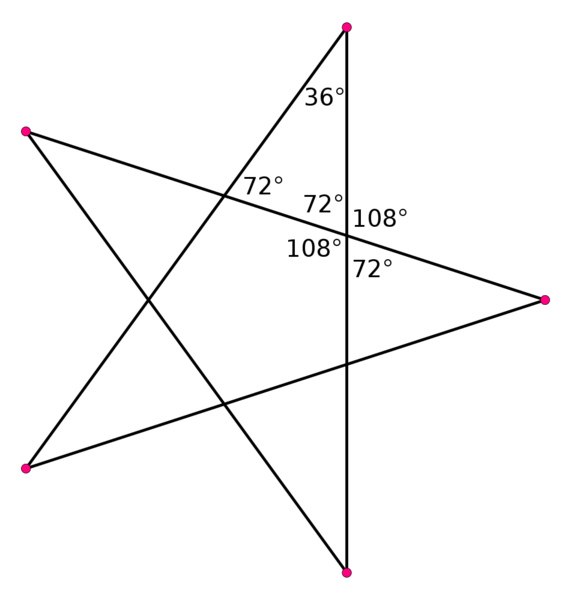

Час 4 - Корњача графика - линијски програми, понављање
######################################################

Веома леп начин да се прикажу неки основни концепти програмирања је и
такозвана корњача-графика у којој се неки замишљени лик креће по
екрану остављајући притом траг који чини цртеж. У ранијим језицима
(пре свега у језику Logo из којег је концепт потекао) лик који је
цртао била је једна корњачица, а у Python-у можемо бирати између
неколико ликова (подразумевано цртање врши један троуглић који се
помера, али без обзира на то што је троугаоног облика, ми ћемо га
називати корњачом). За разлику од робота Карел, који ради само на
порталу "Петља" и којег смо испрограмирали специјално за вас, корњача
графика је саставни део језика Python и програме са корњачом можете
писати и на свом рачунару, ван прегледача веба и портала "Петља" (на
пример у развојном окружењу IDLE). Потребно је само да на свом
рачунару имате инсталирану подршку за програмски језик Python 3, коју
можете преузети са сајта `Python.org <https://www.python.org/>`_ (о
чему смо већ говорили у уводу).

Наредбе корњаче
---------------

Да бисмо у нашим програмима могли користити цртање уз помоћ корњаче,
потребно је прво да укључимо библиотеку за рад са корњачом (то се ради
тако што наведемо ``import turtle``). Након тога можемо издавати
наредбе нашој корњачи. Свака наредба ће почињати са ``turtle.???``.
Кроз неколико једноставних програма прикажимо основне наредбе корњаче.

Цртање линије
'''''''''''''

- Корњача се на почетку налази у центру екрана и окренута је надесно
  (у смеру истока).

- Наредбом ``turtle.forward(100)`` корњачи говоримо да се помери
  напред (у смеру у ком је тренутно окренута) 100 корака и тако, пошто
  наша корњача подразумевано са собом носи оловку којом црта,
  постижемо да се на екрану нацрта дуж дужине 100 пиксела.

.. activecode:: корњача_forward
   :nocodelens:

   import turtle
   turtle.forward(100)

- Да бисмо видели јасније како корњача ради, можемо јој променити
  брзину кретања. ``turtle.speed(0)`` нам даје најбржу корњачу (након
  покретања програма се одмах види готов цртеж), док
  ``turtle.speed(10)`` даје најспорију корњачу (могуће је навести и
  било коју целобројну вредност између 0 и 10).

.. activecode:: корњача_forward_speed
   :nocodelens:

   import turtle
   turtle.speed(10)
   turtle.forward(100)

- Осим померања напред, корњача може да се креће и уназад, цртајући
  при том линију. Наредба којом се то постиже је ``turtle.backward``.

.. activecode:: корњача_backward
   :nocodelens:

   import turtle
   turtle.backward(100)

   
Боја и дебљина линије
'''''''''''''''''''''
   
Могуће је поставити различите параметре који одређују начин на који се
врши исцртавање.

- Да бисмо видели нашу корњачу (уместо стрелице која се подразумевано
  приказује) можемо употребити наредбу
  ``turtle.shape("turtle")``.
- Помоћу ``turtle.color`` можемо променити боју корњаче и њене оловке
  (и тако променити и боју трага тј. линија које се цртају). Као
  параметар ове наредбе у заградама под наводницима наводимо име
  жељене боје на енглеском језику. На пример, наредба
  ``turtle.color("red")`` поставља црвену боју.
- Помоћу ``turtle.width`` постављамо дебљину трага који корњача
  оставља, при чему се дебљина задаје као параметар. На пример,
  наредбом ``turtle.width(5)`` постижемо да линије које се цртају буду
  дебеле 5 пиксела.

Да ли можеш да погодиш шта ће се добити покретањем наредног програма?
Пробај да погодиш, а онда након тога покрени програм и провери да ли
си био/била у праву.
   
.. activecode:: корњача_setparams
   :nocodelens:

   import turtle
   turtle.speed(5)
   turtle.shape("turtle")
   turtle.width(5)
   turtle.color("red")
   turtle.forward(50)
   turtle.color("green")
   turtle.forward(50)

Подизање оловке
'''''''''''''''
   
Корњача током свог кретања оставља траг. Међутим, некада је згодно да
корњачу померимо без цртањa.

- Наредбом ``turtle.penup()`` корњача подиже своју оловку и након тога
  се креће по екрану не остављајући траг све док јој се не изда
  наредба ``turtle.pendown()``, након чега поново почиње да оставља
  траг током кретања.

Допуни наредни програм тако да корњача нацрта испрекидану линију која
се састоји од три дужи.

.. activecode:: корњача_оловка
   :nocodelens:

   import turtle
   turtle.speed(10)
   turtle.forward(20)        # idi napred 20 piksela (olovka je podrazumevano spuštena)
   turtle.penup()            # podigni olovku
   turtle.forward(20)        # idi napred (pošto je olovka podignuta, kornjača ne ostavlja trag)
   turtle.pendown()          # spusti olovku
   turtle.forward(20)        # idi napred 20 piksela
   
Отисци корњаче
''''''''''''''
   
- Наредбом ``turtle.stamp()`` корњача може да остави свој отисак на
  месту на ком се тренутно налази.

Покушај да погодиш који ће се облик добити покретањем наредног
програма.

.. activecode:: корњача_stamp
   :nocodelens:

   import turtle
   turtle.speed(10)
   turtle.penup()          # podigni olovku
   turtle.stamp()          # ostavi trag
   turtle.forward(20)      # idi napred 20 koraka
   turtle.stamp()          # ostavi trag
   turtle.forward(20)      # idi napred 20 koraka
   turtle.stamp()          # ostavi trag

Окретање корњаче
''''''''''''''''
   
- Корњача може мењати свој смер кретања тако што се окреће налево (у
  смеру супротном смеру кретања казаљке на сату) или надесно (у смеру
  кретања казаљке) за одређени број степени, за шта се користе наредбе
  ``turtle.left(n)`` и ``turtle.right(n)`` где је ``n`` број степени.

Покушај да погодиш који ће се облик добити покретањем наредног
програма.

.. activecode:: корњача_rotate
   :nocodelens:

   import turtle
   turtle.speed(10)
   turtle.forward(50)    # idi napred 50 koraka
   turtle.left(60)       # okreni se levo 60 stepeni
   turtle.forward(50)    # idi napred 50 koraka
   turtle.right(60)      # okreni se desno 60 stepeni
   turtle.forward(50)

Резимирајмо све наредбе корњачи које смо до сада поменули.
   
======================  ==========================================================================
``turtle.forward(n)``   корњача се помера напред за ``n`` корака
``turtle.backward(n)``  корњача се помера назад за ``n`` корака
``turtle.left(n)``      корњача се окреће налево за ``n`` степени
``turtle.right(n)``     корњача се окреће надесно за ``n`` степени
``turtle.penup()``      корњача подиже оловку
``turtle.pendown()``    корњача спушта оловку
``turtle.color(c)``     боја оловке се поставља на боју ``c``
                        (назив је на енглеском језику, нпр. ``"red"``, ``"green"``, ``"blue"``)
``turtle.width(n)``     дебљина оловке се поставља на вредност ``n``
``turtle.stamp()``      корњача оставља свој отисак
``turtle.shape(s)``     корњача мења свој облик (нпр. ``"arrow"``, ``"turtle"``, ``"circle"``)
``turtle.speed(n)``     корњача мења своју брзину кретања од 0 (најбрже) до 10 (најспорије)
======================  ==========================================================================

Комплетан списак свих наредби корњаче може се наћи у `званичној
документацији <https://docs.python.org/3/library/turtle.html>`_ језика
Python 3.

Скраћени запис
--------------

Постоји начин да се наредбе запишу краће. Ако се уместо ``import
turtle`` библиотека за рад са корњачом увезе помоћу ``import turtle as
t``, тада уместо ``turtle.???`` можемо писати само ``t.???``. На
пример, уместо ``turtle.color("red")`` можемо писати само
``t.color("red")``. Додатно, неке наредбе имају скраћени облик.  На
пример, померање напред ``n`` пиксела можемо постићи помоћу
``t.fd(n)``, померање назад помоћу ``t.bk()``, окрет налево за ``n``
степени помоћу ``t.lt(n)``, надесно помоћу ``t.rt(n)`` и слично.

На пример, цртеж можемо нацртати и наследећи начин.

.. activecode:: корњача_скраћени_запис

   import turtle as t
   t.color("red")
   t.fd(100)
   t.lt(90)
   t.fd(150)

                 
Линијски програми
-----------------

Штриклирање
'''''''''''
.. level:: 1

.. questionnote::

   Напиши програм у којем корњача исцртава знак за штриклирање. Окреће
   се ка југоистоку, иде затим 50 корака, онда се окреће ка
   североистоку и иде 100 корака. Знак исцртај плавим дужима,
   дебљине 5.

.. activecode:: корњача_штриклица
   :nocodelens:
   :playtask:
		
   import turtle
   # dovrši program
   ====
   import turtle

   turtle.color("blue")
   turtle.width(5)
   turtle.right(45)
   turtle.forward(50)
   turtle.left(90)
   turtle.forward(100)

Квадрат
'''''''
.. level:: 1

.. questionnote::

   Напиши програм у којем корњача црта квадрат чија је дужина страница
   100 корака.

Квадрат се може нацртати тако што се четири пута корњачи зада да иде
100 корака напред и да се затим окрене за 90 степени (на пример,
налево). Допуни наредни програм тако што ћеш додати још наредби.
   
.. activecode:: корњача_квадрат
   :nocodelens:

   import turtle
   turtle.forward(100)   # иди напред 100 корака
   turtle.left(90)       # окрени се 90 степени налево
   turtle.forward(100)   # иди напред 100 корака
   turtle.left(90)       # окрени се 90 степени налево
   # dopuni program

За вежбу пробај да допуниш претходни програм тако да се црта шарени
квадрат (сваку страницу обоји другом бојом).

Квадратни корен
'''''''''''''''
.. level:: 2

.. questionnote::

   Напиши програм који исцртава математички знак за квадратни корен
   (дугметом **Прикажи пример** можеш видети како он треба да
   изгледа).

.. activecode:: корњача_корен
   :nocodelens:
   :playtask:
   
   import turtle
   # dovrši program
   ====
   import turtle
   turtle.color("red")
   turtle.width(7)
   turtle.forward(20)
   turtle.right(60)
   turtle.forward(100)
   turtle.left(135)
   turtle.forward(200)
   turtle.right(75)
   turtle.forward(200)

Лого Петље
''''''''''
.. level:: 2

.. questionnote::

   Напиши програм у којем корњача црта лого фондације петља. Лого се
   састоји од два квадрата странице 50 корака, која се додирују и
   окренути су 45 степени у односу на хоризонталу.

   .. image:: ../../_images/petlja.png
	:width: 200px
	:align: center

Допуни наредни програм наредбама којима се корњача окреће, тако да се
добије тражена слика.
		
.. activecode::	лого_петље
   :nocodelens:
   :enablecopy:
   :playtask:

   import turtle
   turtle.color("#18BC9C")
   turtle.width(20)
   ??? # okreni se
   turtle.forward(50)
   ??? # okreni se
   turtle.forward(100)
   ??? # okreni se
   turtle.forward(50)
   ??? # okreni se
   turtle.forward(50)
   ??? # okreni se
   turtle.forward(100)
   ??? # okreni se
   turtle.forward(50)
   ====
   import turtle
   turtle.color("#18BC9C")
   turtle.width(20)
   turtle.left(45)
   turtle.forward(50)
   turtle.right(90)
   turtle.forward(100)
   turtle.left(90)
   turtle.forward(50)
   turtle.left(90)
   turtle.forward(50)
   turtle.left(90)
   turtle.forward(100)
   turtle.right(90)
   turtle.forward(50)
   
		

Понављање
---------

У програмима које задајемо корњачи често су облици правилни и неке се
наредбе понављају. Стога у програмима можемо користити и
петље. 

Квадрат - петља
'''''''''''''''
.. level:: 1
	   
.. questionnote::

   Исправи наредни програм тако да корњача црта квадрат чија је
   страница дугачка 100 корака.

Програм који исцртава квадрат можемо да скратимо ако уведемо наредбу
којом постижемо да се неки задати низ наредби више пута понови. Као
што смо видели, у језику Python најлакши начин да се то уради је
наредба ``for``.  Као што смо већ видели, наредбу *ponovi n puta*
можемо записати као ``for i in range(n):``. Подсетимо се, не смемо да
заборавимо двотачку, а наредбе које се понављају наводимо увучене
неколико размака у односу на положај наредбе ``for``.
   
.. activecode:: корњача_квадрат_петља
   :nocodelens:

   import turtle
   for i in range(0):        # ponovi 4 puta:
       turtle.forward(0)     #   idi napred 100 koraka
       turtle.left(0)        #   okreni se nalevo za 90 stepeni

Провери своје разумевање петљи тако што ћеш поређати наредбе програма
у ком корњача исцртава једнакостранични троугао.

.. parsonsprob:: троугао_ређање

   Поређај делове кода тако да представљају исправно решење овог задатка.
   -----
   import turtle
   =====
   turtle.color("red")
   =====
   for i in range(3):
   =====
      turtle.forward(100)
   =====
      turtle.left(120)

       
Испрекидана линија
''''''''''''''''''
.. level:: 1

.. questionnote::

   У једном од претходних задатака нацртали смо испрекидану линију
   тако што смо пуно пута понављали исте наредбе. Скрати претходни
   програм коришћењем петље тако што ћеш нацртати испрекидану линију
   која се састоји од пет делова.

.. activecode:: испрекидана_линија
   :nocodelens:
   :enablecopy:
   :playtask:

   import turtle
   for i in range(5):
                                  # idi napred 20 koraka
                                  # podigni olovku
                                  # idi napred 20 koraka
                                  # spusti olovku
   ====
   import turtle
   for i in range(5):
       turtle.forward(20)           # idi napred 20 koraka
       turtle.penup()               # podigni olovku
       turtle.forward(20)           # idi napred 20 koraka
       turtle.pendown()             # spusti olovku

Отисци корњаче
''''''''''''''
.. level:: 1

.. questionnote::
   
   Напиши програм који коришћењем понављања исцртава 5 отисака корњаче
   размакнутих по 30 пиксела. Напиши програм без коришћења петље, а
   затим га скрати коришћењем петље.

.. activecode:: пет_отисака_корњаче
   :nocodelens:
   :enablecopy:
   :playtask:

   import turtle
   ====
   import turtle
   turtle.penup()
   turtle.shape("turtle")
   for i in range(5):
       turtle.stamp()
       turtle.forward(30)

       
Правилни многоугао
''''''''''''''''''
.. level:: 2

.. questionnote:: 

   Уопшти претходни програм тако да уместо цртања квадрата корњача
   црта неки други правилни полигон (на пример, једнакостранични
   троугао, правилни петоугао, правилни шестоугао и слично).

Ако је дат број *n* правилни *n*-тоугао (правилни полигон са *n*
страна) добијамо тако што нацртамо *n* његових страница. Зато је
цртање странице и окретање потребно поновити *n* пута. Након цртања
сваке странице корњача треба да се окрене тачно за величину спољашњег
угла полигона. Важи да је збир свих спољашњих углова у полигону једнак
360 степени, па пошто су сви они једнаки, сваки од њих је једнак
количнику бројева 360 и *n*. Други начин да одредимо угао за који се
корњача окреће у сваком кораку је да се примети да она цртање почиње и
завршава окренута ка истоку и да се у међувремену, током цртања,
окреће тачно за износ једног пуног круга тј. за
:math:`360^\circ`. Пошто се у сваком кораку окреће подједнако, окрет
износи тачно :math:`\frac{360^\circ}{n}`. У програмском језику Python,
количник бројева ``a`` и ``b`` можемо израчунати помоћу ``a / b``
(више речи о томе биће речено у поглављу о аритметичким операцијама и
дељењу), па број :math:`\frac{360}{n}` можемо израчунати помоћу ``360
/ n``.

Као и у претходним случајевима, твој задатак је да исправиш грешке у
следећем програму.

.. activecode:: корњача_нтоугао_петља
   :nocodelens:
   :enablecopy:
   :playtask:

   import turtle
   n = 6
   for i in range(0):         # ponovi n puta:
       turtle.forward(0)        #   idi napred 100 koraka
       turtle.left(0)           #   okreni se za 360:n stepeni
   ====
   import turtle
   n = 6
   for i in range(n):         # ponovi n puta:
       turtle.forward(100)      #   idi napred 100 koraka
       turtle.left(360 / n)     #   okreni se za 360:n stepeni
     
.. infonote::

   Збир унутрашњих углова сваког *n*-тоугла (у Еуклидској
   геометрији) једнак је вредности :math:`(n-2)\cdot
   180^\circ`. Заиста, ако из неког темена конвексног многоугла
   повучемо све његове дијагонале оне ће га поделити на укупно
   :math:`n-2` троугла (на наредној слици, петоугао је на тај начин
   подељен на три троугла).

   .. image:: ../../_images/uglovi_poligona.png
      :width: 300px   
      :align: center

   Збир углова у сваком троуглу (у Еуклидској геометрији) је
   :math:`180^\circ`.  Сваки унутрашњи угао полигона једнак је
   збиру неколико углова тих троуглова, док је сваки унутрашњи угао
   троугла део тачно једног од унутрашњих углова полигона, па је
   укупан збир унутрашњих углова полигона једнак укупном збиру
   углова тих троуглова, а то је тачно :math:`(n-2)\cdot
   180^\circ`.

   Сваки спољашњи угао полигона је допуна унутрашњег угла до
   :math:`180^\circ` степени (његов суплемент). Пошто је тих углова
   :math:`n` важи да је збир спољашњих углова једнак разлици броја
   :math:`n \cdot 180^\circ` и збира унутрашњих углова полигона,
   који је, на основу претходног, једнак :math:`(n-2)\cdot
   180^\circ`. Зато је збир спољашњих углова полигона једнак
   :math:`n\cdot 180^\circ - (n-2)\cdot 180^\circ`, што је тачно
   :math:`360^\circ`.
   
Звезда
''''''
.. level:: 2

.. questionnote::

   Напиши програм у којем корњача црта звезду са пет кракова.

.. infonote::

   Звезда са пет кракова (тзв. "петокрака") је током историје била
   симбол којем су приписивана различита значења. Ми је посматрамо
   искључиво као геометријски објекат и ограђујемо се од било каквог
   њеног другог значења.

   
Звезда са пет кракова се састоји од централног правоуглог петоугла на
чијим се ивицама налазе једнакостранични троуглови. Збир унутрашњих
углова у правилном петоуглу је :math:`(5-2)\cdot 180^\circ` тако да је
сваки угао једнак :math:`108^\circ`. Ако посматрамо углове на базама
два суседна крака (једнакостранична троугла) видимо да су они унакрсни
и да заједно са углом од :math:`108^\circ` и са њему унакрсном углом
чине пун угао. Стога је сваки угао на основици крака једнак
:math:`\frac{360^\circ - 2 \cdot 108^\circ}{2} = 72^\circ`. Пошто је
збир углова у краку једнак :math:`180^\circ`, угао при врху крака
једнак је :math:`180^\circ - 2 \cdot 72^\circ = 36^\circ`. Та
информација нам је кључна да бисмо могли да нацртамо звезду. Звезду
ћемо цртати тако што ћемо пет пута нацртати дуж од 100 корака и затим
се окренути тако да наредна дуж заклопи угао од :math:`36^\circ` са
претходном. Да бисмо то постигли, корњача треба да се окрене надесно
за суплемент тог угла тј. за угао од :math:`180^\circ - 36^\circ =
144^\circ`.

Теби препуштамо да на основу ове дискусије допуниш наредни програм.

.. activecode:: корњача_петокрака
   :nocodelens:
   :enablecopy:
   :playtask:

   import turtle
   for i in range(5):         # ponovi 5 puta:
                              #   idi napred 100 koraka
                              #   okreni se nadesno 144 stepena
   ====			      
   import turtle
   for i in range(5):         # ponovi 5 puta:
       turtle.forward(100)     #   idi napred 100 koraka
       turtle.right(144)       #   okreni se nadesno 144 stepena

   

Домаћи задатак
--------------

За домаћи задатак уради наредне задатке.

Слово L
'''''''
.. level:: 1

.. questionnote::   

   Напиши програм у којем корњача исцртава велико латиничко слово L (окреће се
   ка југу, затим иде 100 корака, окреће се ка истоку и онда иде 50 корака).

.. activecode:: корњача_слово_L
   :nocodelens:
   :playtask:

   import turtle
   # dovrši program
   ====
   import turtle
   
   turtle.right(90)
   turtle.forward(100)
   turtle.left(90)
   turtle.forward(50)

Слово И
'''''''
.. level:: 1
   
.. questionnote::

   Напиши програм у којем корњача црта ћириличко слово И. Цртање креће тако
   што корњача прво иде 100 корака ка југу, затим 141 корак ка североистоку и
   затим поново 100 корака ка југу.

.. activecode:: корњача_и
   :nocodelens:
   :playtask:

   import turtle
   # dovrši program
   ====
   import turtle

   turtle.right(90)
   turtle.forward(100)
   turtle.left(135)
   turtle.forward(141)
   turtle.right(135)
   turtle.forward(100)

Плаво-црвена линија
'''''''''''''''''''
.. level:: 1

.. questionnote::

   Напиши програм у којем корњача црта плаво-црвену линију која
   састоји од 5 плавих и 5 црвених дужи дужине од по 20 пиксела које
   се наизменично смењују. Реализуј програм тако да се у телу петље
   које се понавља 5 пута црта једна плава и једна црвена дуж.

.. activecode:: корњача_црвено_плава_линија
   :nocodelens:
   :playtask:

   import turtle
   # dovrši program
   ====
   import turtle

   for i in range(5):
       turtle.color("blue")
       turtle.forward(20)
       turtle.color("red")
       turtle.forward(20)

   

       
Отисци корњаче у теменима n-тоугла
''''''''''''''''''''''''''''''''''
.. level:: 2

.. questionnote::
   
   Напиши програм након који поставља отиске корњаче у сва темена
   правилног n-тоугла.

.. activecode:: отисци_n_тоугао
   :nocodelens:
   :enablecopy:
   :playtask:

   import turtle
   n = 6
   ====
   import turtle
   n = 6
   turtle.shape("turtle")
   turtle.penup()
   for i in range(n):
       turtle.stamp()
       turtle.forward(80)
       turtle.left(360 / n)
   

       
